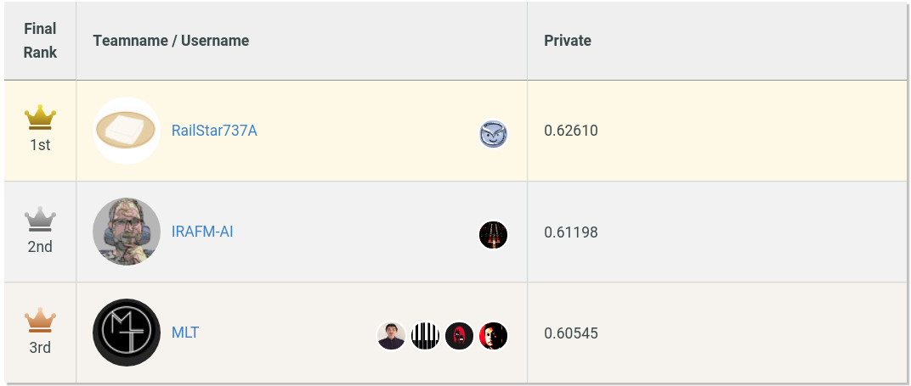
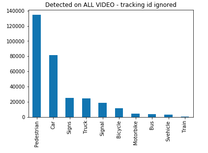
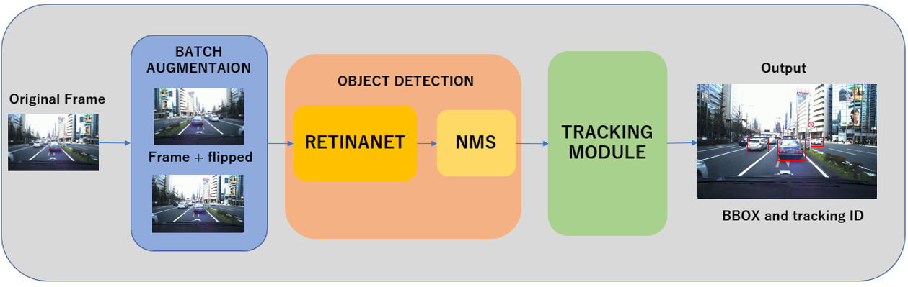
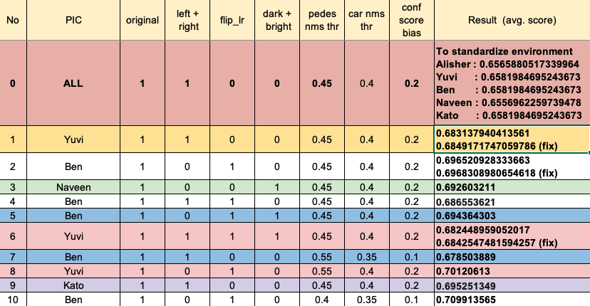

# Introduction

MLT is a Tokyo-based nonprofit organization dedicated to democratizing Machine Learning. We are a team of ML Engineers and Researchers and a community of more than 6000 people.
Our mission is to create, grow and sustain an inclusive, collaborative and engineering focused environment for students and professionals. Together we facilitate opportunities to learn, study and work on Machine Learning and Deep Learning projects and support individuals to reach their fullest potential.

In this path of learning practical skills and experience, we encourage everyone to take part into collaborative projects and competitions (*example ~ Agriculture project- ...*).
This blog summarizes our (5 MLT members) work and experience for taking part into the [The 3rd AI Edge Contest (Algorithm Contest 2)](https://signate.jp/competitions/256).

We would like to thank [Signate](https://signate.jp/) for hosting this exciting competition. Please check out all the ongoing competitions to gain experience with a large number of datasets.

As a Tokyo based organisation, having the opportunity to work on **“a made in” Tokyo dataset** was really motivating and gave us the feeling to work on a real world project compared to other competitions.
On top of that, the field of [MoT](https://en.wikipedia.org/wiki/Multiple_object_tracking) is still a hot research topic, and certainly very challenging by its complexity and application.

After 3 months of hard and fully remote work, we achieved a third position in the competition, over 35 teams (total of 305 participants). We would like to congratulate all the other teams for the hard competition as even at the very last minute we were at the 5th position. Some solutions were disclosed in the [competition forum](https://signate.jp/competitions/256/discussions/solution-of-irafm-ai-team).

The following section will explain the contest content, then we will detail our solution architecture, and finally sum-up the learned lesson on this context.

** ---- GIF OBJECT TRACKING ON VIDEO ----- **

# Edge AI contest task definition (to be completed and corrected)

The purpose of the competition was to develop a robust object tracking subject using the image of a vehicle front camera.

We were given a total of 25 videos (each video consisting of 600 frames), with separate annotation files.

number of images per class ?

No test set were provided, all the evaluation was done on Signate side, as we upload our source code for each submission. The criteria for evaluation was composed into 2 parts an Object Detection score (IoU) and a Tracking evaluation match-mismatch combine into 1 score: MOTA. Please check the evaluation details on [the competition page](https://signate.jp/competitions/256#evaluation).

evaluation metric - MOTA

# How did we tackle the task?
We discussed and decided to split the main task into two sub-tasks. The primary aim was to be able to work on different sub-tasks independently, i.e. not sequential - we should not have to wait to finish a first subtask to start the next.

- object detection sub-task: the training videos are used as training data and performance is evaluated considering only object detection performance - mAP (mean Average Precision, Average Precision per class)

- object tracker sub-task: although the final evaluation would consider the object detector and object tracker's performance, we decided to use the ground truth detection labels (bbox coordinates of objects) to develop the object tracker.

## 1. Pre-processing

We split the video frames into individual pictures and saved in .png format. So each video generated 600 images. We used the ffmpeg tool to do this in a bash script to run on all the videos. The reason to use ffmpeg was that the opencv method from jupyter notebook was too slow.

We split the entire data as follows :
- Training data : train_02 ~ train_24
- Validation data : train_00, train_01

We also converted the given annotation data to a keras-retinanet's CSV data format.

We used 5 classes out of total 10 classes to train our model.

## 2. Object Detection
There are mainly two types of deep learning based object detection algorithms:

- two-stage object detectors: R-CNN, Fast R-CNN, Faster R-CNN

- single-stage/single-shot object detectors: SSD, YOLO, RetinaNet.

Since single-stage object detectors are faster and this contest was about edge AI, we decided to use single-stage object detector - RetinaNet because it is really efficient with dense and small scale objects while assuring fast inference for edge device application as being a single stage detector and we already had an experience on training RetinaNet model. Please have a look at [the annotated paper](https://github.com/Machine-Learning-Tokyo/papers-with-annotations/blob/master/object-detection/RetinaNet.pdf) to learn more about this architecture.

First, we trained the model using all available classes in training data (`Pedestrian`, `Car`, `Truck`, `Signs`, `Svehicle`, `Bus`, `Train`, `Motorbike`, `Signal`, `Bicycle`) and fine tuned on only two classes (`Pedestrian` and `Car`) since only those classes would be considered during the evaluation. Then, we thought it could be better to train on only relevant classes (`Pedestrian` and `Car`) to get rid of unnecessary class predictions (which could make it easier for detector to predict correct classes). We have confirmed that this works better than the former one in terms of mAP score on validation set. `Pedestrian: 0.7713 AP` & `Car: 0.9244 AP`.

After a comprehensive visual analysis, we have seen that the model gets confused with some classes. For instance, the model predicts the "Bus" as "Car". This kind of mis-detections increases the False Positives (which leads to lower MOTA metric).  Then, we concluded that it may be better to include the similar classes on top of the previous classes: (`Pedestrian`, `Car`) + (`Bus`, `Truck`, `Svehicle`). The newly added classes were getting confused with Pedestrian class. By including (and re-training the detection model) we prevent those confusions. 

### Training details: 

**Backbone model:** ResNet101 (pre-trained on ImageNet)

**Image resizing:** didn't resize the video frames (still images) which had the shape of `1936x1216x3`. 

**Learning rate:** `1e-5` 

**Augmentations:** rotation `(-0.2, 0.2)`, translation `(-0.2, 0.2)`, shear `(-0.2, 0.2)`, scaling `(0.7, 1.4)`, horizontal flip (with `0.5` probability).

**Classes:** `Pedestrian`, `Car`, `Truck`, `Bus`, `Svehicle`

**Epochs:** trained for 100 epochs. Epoch 15 snapshots have been chosen (we didn't consider the small mAP score differences between different snapshots, because doing this may lead us to overfit on validation dataset). Epoch 15 had AP (average precision) for `Pedestrian: 0.7713` and for `Car: 0.9244`.

**Training data format:** we have used csv data format: `image_fpath,x1,y1,x2,y2,class` (please check keras-retinanet repository).

## 3. Object Tracking

We formalized the tracking problem as a maximum weighted matching problem for objects in two adjacent frames and solved it using [Hungarian Algorithm](https://en.wikipedia.org/wiki/Hungarian_algorithm#:~:text=Hungarian%20algorithm%20%2D%20Wikipedia-,Hungarian%20algorithm,anticipated%20later%20primal%2Ddual%20methods.).

For matching costs, we utilized several features as:
- position
- size
- image similarity (histogram)

Our tracker keeps all the history of object tracking and estimates the next position of each object in the next frame by linear or quadratic regression.

Then, the tracker tries to match objects with close position, similar size and similar image as much as possible.
During object matching, the tracker also takes into account the object appearance and disappearance.

We added some virtual objects where the objects matched to these virtual objects are regarded as newly appeared or disappeared.

The disappeared objects are also kept in the tracker for a while and can be matched to some objects in the subsequent frames.

## 4. Combining object detection and object tracking: prediction phase and post-processing.
- Test time augmentations: during the inference instead of feeding the original image only, we fed the batch of images: original image + augmented versions. As for the test time augmentation we have tried `horizontal flip`, `brightening`, `darkening`, `right/left crop: crop the right/left region of an image`. Among these test time augmentations we find that only horizontal flip is helpful. We could not exploit all of them because of restricted inference time per frame.

- Confidence scores: we have fixed the confidence threshold as `0.5` for original image predictions. However, for flipped version (basically for every test time augmentations we have tried) of the image, we defined a new parameter - `conf_score_bias=0.1` -  which is added to `0.5` to yield a confidence threshold for predictions from flipped version of input image. This parameter (`conf_score_bias`) implies that we should not give similar chance for original and augmented image prediction, i.e. accept the predictions from augmented version if and only if it is larger than 0.6 which means it is more confident.

- Combining predictions for different image versions: since we have fed 2 images (original + horizontally flipped) to the model, we get multiple predictions, i.e. we had to merge object bounding boxes. We have used two different nms methods: (we call it) local nms and global nms. Local nms is applied to predictions resulting from the different batch images. Global nms is applied after merging (concatenating) the predictions from original and flipped input images. For local nms we have used `IoU=0.8` and for global nms we have used `IoU=0.5`.

- Post-processing heuristic: during the visual analysis, we found that there are no objects at very top and very bottom part of frame at all. Thus, we have applied this heuristic as a post-processing; discard any predictions if y-coordinate was above `365` or below `851`.

- Here is a sample output from Object Detection.
Green box is Car, while Red box is Pedestrian.

- Here is sample output from Object Tracking.
The color change when the assigned box id change.

# What we have tried and didn't work?
- Test time augmentations:  "brightening", "darkening", "right crop", "left crop" augmentations did not work well. Only "horizontal flip" helped to increase the overall performance.

- Adaptive nms threshold for "Pedestrian" class: use adaptive nms IoU threshold according to the number of detections. This was due to the crowded scenes, i.e., if there are a lot of pedestrians in the frame then probably their bounding boxes should be overlapping more compared to the less crowded frames. We tried this but could not fine-tune well to get better MOTA score.

- Reject confidence score outliers: we had a plan to reject object outliers according to their confidence score considering that the objects in the same frame should be visible with similar probability. However, this didn't help either because we did not have enough time to fine-tune or because it really does not help.

- Classification phase: we considered to train another model to classify the object detection predictions into `Pedestrian` and `Car` classes (binary classification). This could help to curate object detection results as well as object tracker when matching inter-frame objects. However, we did not have enough time to try this. 

- some failed trials from object tracker can be added here

# Conclusion

## Conclusion on this project
This competition was really challenging on the technical side (MOT, training setup for the team) and organisation side (team of 5, corona circumstances).
Finishing in the podium was really rewarding as we really hard work on these submission. Each member were able to learn new skills and tips, and we are looking forward to pursue our way in implementing ML to solve pratical problem with MLT.

Concerning this project, we do plan to continue to develop it by:
1. Fine tuning our solution
2. **Implementation on edge**:
We plan to deploy our solution on edge (Jetson Nano - FPGA), and itegrate this module to a bike for example. We can also add so GPS, statistic analysis on the traffics, ...

## Lessons learned
Here is a list of lesson learned (the hard way  ):

#### What went well:

- An healthy remote planing and meeting is important: We worked for total of 15 days (mostly Saturday/Sunday), except for last week of submission. Though the last week was really busy. Everyone came online after office work on video call, which sometimes went all the way till midnight.

- Regular Project Syncup Meetings with simple format
  - Done Tasks
  - ToDo / Waiting (Next Steps)
- Git Workflow (Best Practices).
  - In exploration phase : Individual member creates his / her own feature branch
  - In collaboration phase : All individual developments merge to develop branch and all members work on this branch from that point.
  - All submissions to be made from the master branch.

- Keep on participating in hackathons as it provides an opportunity to connect and discuss with people.
- Task Assignment should be clear and non overlapping. This provides smooth progress.
- Fine tuning the model to a given dataset may lead to overfitting. So keeping a balance of submission results and overfitting is necessary.
- Running the entire pipeline for submission once is quite important to keep team motivation.
- Documentation of evaluation results in tabular format while fine tuning a model.

#### What can be improved:

- Lack of analysis of provided code can lead to downfalls at a later stage as we near the deadline. Eg beforehand analysis of videos / reading the provided scripts and understanding them completely is equally important as just using them.

- Late integration always leads to problems. So it is always a nice idea to integrate as a skeleton code first and then start working on a project. In fact, a better way would be to just define everything as dummy and write skeleton code. But the problem even with this approach is that the specifications about model and architecture should be fixed beforehand. If the project involves exploration, then it might be difficult to write skeleton code right from start.

- System interdependence can be explored if there is sufficient time after integration. Eg. in our case, the object tracker could have used information from the object detector and vice versa.

#### What we may try to do in the next project:

- Cleaning and Re-Annotation of given dataset.
- Automation pipeline for testing various combinations of parameters for fine tuning the model.
- More Modular code to plug in any model other than RetinaNet.
- Choosing the training and validation dataset very carefully when limited data is provided.
