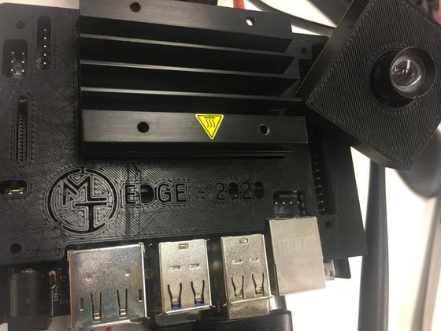

# Running this project on Edge [WIP]




## The idea
We wanted to deploy our solution on edge to pursue the project to real application. We decided to build an application for bike:
- Help tracking number of cars / pedestrian that came accross your road.

## Hardware
We decided to deploy our solution on a [Jetson Nano Board](https://developer.nvidia.com/embedded/jetson-nano-developer-kit) *mostly for practical reason,available by the team member, and small enough to be attached on the bike.*

## Set up

#### Hardware
- The power is provided by a Lipo battery, and supply the jetson with 5V-3A.
- We tried Raspberry Camera (CSI) and USB camera

#### Software
- jetson image (JetPack 4.4, 2020/07)
- install tensorflow:
```
pip install -U numpy==1.16.1 future==0.17.1 mock==3.0.5 h5py==2.9.0 keras_preprocessing==1.0.5 keras_applications==1.0.8 gast==0.2.2 futures protobuf pybind11
pip install --pre --extra-index-url https://developer.download.nvidia.com/compute/redist/jp/v44 tensorflow==2.2.0+nv20.7
pip install scipy keras
```
- build retinanet (take long) or pip install:
```
sudo apt -y install libcurl4-openssl-dev
sudo apt install openssl libssl-dev
git clone https://github.com/fizyr/keras-retinanet.git
pip install .
```

#### Performances
In order to have *acceptable inference speed* we retrain the model with a lower resolution, and tune some parameters. We currently have an inference speed of **2.5 sec** for 3 tracked object.

#### Improvement
- Build a TensorRT version of retinatnet. Currently lot of ops are not supported by RT, and so make the convertion impossible.
- Ideas ? Please feel free to share